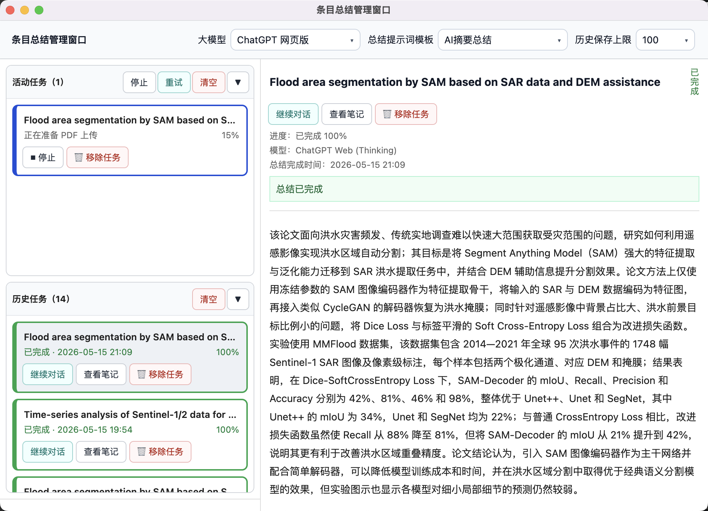

# AiNote for Zotero

    

    <a href="../README.md">中文版说明请点击这里</a>

## Introduction

AiNote is a Zotero plugin for calling large language models to generate and process AI-powered note content within Zotero. It currently supports AI literature summarization, prompt templates, note format adjustment, and quick section operations in the note editor.

## Features

- **AI-powered PDF summarization**: Generate concise notes for academic papers with one click, supporting multiple AI services.
- **ChatGPT Web summarization**: Supports summarization through the companion Chrome extension by interacting with ChatGPT Web and returning results to Zotero.
- **Dual PDF processing modes**: Supports `base64 multimodal mode` and `text extraction mode`, allowing you to choose based on model capabilities and speed requirements.
- **Real-time streaming display**: View AI-generated content in a popup window with live streaming output.
- **Per-item summary window**: Track each item's summarization progress and output in a dedicated window, especially useful for batch tasks.
- **Batch processing**: Select multiple items and generate notes at once, with each item's content clearly separated.
- **Automatic note saving**: After streaming completes, content is automatically saved to Zotero notes.
- **Prompt templates**: Create and switch between commonly used prompt templates for different summarization tasks.
- **Note format adjustment**: After selecting a note, quickly fix common AI note formatting issues with one click.
- **Quick section editing**: In the note editor, right-click on a heading line to perform heading level changes, section numbering, and deletion.
- **Customizable models and API configuration**: Flexibly adjust model, API endpoint, and prompts.

## Usage

- Select one or more PDF items in Zotero.
- Right-click and choose `Generate AI Summary Note`.
- Select the desired prompt template from the submenu.
- If you want to summarize via ChatGPT Web, choose `Summarize via ChatGPT Web` in plugin settings (requires the companion Chrome extension to be installed and enabled first).
- The plugin will execute the AI summary using the selected prompt template and name the generated note based on the template name.
- A popup window will appear showing the AI-generated content in real-time.
- During batch summarization, you can open the per-item summary window to view each item's status, streaming output, and completion state.
- For multiple items, each item's content is clearly labeled and separated.
- Once processing completes, all summaries are automatically saved to corresponding Zotero notes.
- You can close the output window at any time.

Per-item summary window example (for viewing and managing the progress and results of tasks):

    

### Other Entry Points

- After selecting one or more note items, right-click to use the `Note Format Adjustment` feature.
- When editing a note in the Zotero note editor, if the cursor is on a heading line, the right-click menu will show a `Section Format Adjustment` submenu.

    
        
    

## Installation

1. Download the latest release from the [GitHub repository](https://github.com/BlueBlueKitty/zotero-ainote/releases).
2. In Zotero, go to `Tools > Add-ons` and install the AiNote plugin.
3. Restart Zotero if needed.

### Install and Enable the ChatGPT Web Chrome Extension

1. Open your system's default browser and go to the extensions management interface.
2. Enable Developer Mode.
3. Click Load Unzipped Extension.
4. Download the [extension ZIP file](https://raw.githubusercontent.com/BlueBlueKitty/zotero-ainote/main/dist/ainote-web-extension-v0.1.0-edge.zip), then extract it locally.
5. In `Load unpacked`, select the extracted extension folder, and the extension can be successfully installed.
6. Open the extension options page and confirm `Bridge URL` is set to `http://127.0.0.1:23123` (this is the default value). Click "Test Connection". If the connection is successful, you can use the ChatGPT web summary function of the ainote plugin.

**If the ChatGPT web summary function fails to work properly, please update the Zotero-Ainote plugin and the browser extension as soon as possible.**

## Configuration

### Basic Configuration

Configure the following parameters in Zotero's `Tools > AiNote Preferences`:

- **API Key**: Your AI service API key
- **API URL**: The endpoint URL of the AI service
- **Model**: The model name to use
- **Stream**: Whether to enable streaming output

The plugin automatically detects the service provider based on your configured **API URL** and adapts the calling method accordingly; no manual service type selection is needed.

### Currently Supported AI Services

- Azure OpenAI
- Anthropic Claude
- Google Gemini
- DeepSeek
- OpenAI [Chat Completions API]
- OpenAI [Responses API]
- ChatGPT Web

## PDF Processing Modes

The plugin currently supports two PDF processing methods:

### 1. Base64 Multimodal Mode

- Sends PDF content as multimodal input to models that support vision or document understanding.
- Suitable for models with native document understanding capabilities.

### 2. Text Extraction Mode

- First extracts text from the PDF, then sends the text to the model for summarization.
- Suitable for models that do not support multimodal document input or prefer pure text processing.

## Prompt Templates

The plugin supports prompt templates for maintaining different prompt styles for various tasks, such as:

- AI full-text summarization
- AI abstract summarization
- AI structured summarization
- AI innovation point summarization

Using prompt templates makes it easier to reuse existing prompts without manual editing each time.

The plugin also automatically names generated notes based on the currently selected prompt template name, making it easy to distinguish AI notes for different purposes.

## Note-Related Features

### 1. Note Format Adjustment

- Select a note item in Zotero, then use `Note Format Adjustment` from the right-click menu.
- Suitable for cleaning up common AI note formatting issues for easier editing or export.
- Currently includes the following 4 functions:

1. `Fix Math Formulas`
2. `Downgrade All Headings`
3. `Upgrade All Headings`
4. `Remove Extra Line Breaks`

### 2. Quick Section Editing in Note Editor

When editing a note in the Zotero note editor, if the cursor is on a heading line, the right-click menu will show a `Section Format Adjustment` submenu containing the following 5 functions:

1. `Upgrade Current Heading`
2. `Downgrade Current Heading`
3. `Increase Section Number`
4. `Decrease Section Number`
5. `Delete Current Section`
